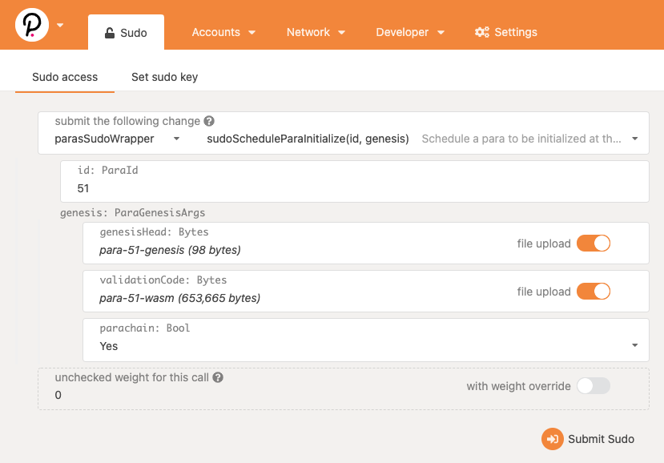
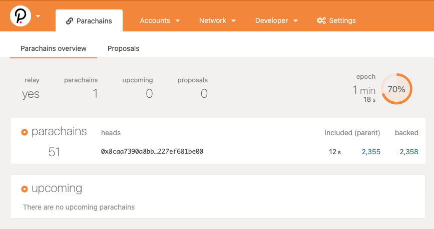

# Local Rococo Network
Following the [Cumulus Workshop](https://substrate.dev/cumulus-workshop) we want to run a local Rococo network and register a Parachain to be validated by the Relaychain.

We are using the predefined chain spec provided by the Cumulus Workshop although it would also be possible to create our own chain spec.

## Run the Relaychain
The Relaychain validators `ALICE` and `BOB` can be started using the provided docker-compose file.

The setup is currently using the chain spec `rococo-local-2-validators.json`. This will only allow us to register only **ONE** Parachain. If you need to register more Parachains you can adjust the docker-compose file to use another chain spec and add additional nodes.

## Option A: Build the standard Parachain
For now we just want to learn how Polkadot works and how to register a Parachain. We will build and register a Parachain based on the standard [Parachain Template](https://github.com/substrate-developer-hub/substrate-parachain-template).

```shell
# Clone the Parachain Template
git clone  https://github.com/substrate-developer-hub/substrate-parachain-template

# Switch into the Parachain Template directory
cd substrate-parachain-template

# Build the parachain template collator
cargo build --release
```

The executable `parachain-collator` will be available in `/target/release/parachain-collator` and required to run a Parachain Collator.

**Note**: Substrate (and thus Polkadot) requires the Rust Nightly Toolchain. Check out the [installation instructions](https://substrate.dev/docs/en/knowledgebase/getting-started/#manual-installation) in the official documentation.

## Option B: Develop & build a custom Parachain

### 1. Develop
### 2. Build
In order to build the custom Parachain follow the instructions in Option A. The process is the same.

## Run the Parachain Collator
In order to run the Parachain you need the executable `parachain-collator` and the chain spec which we used in the docker-compose setup. You also need to define a Parachain id (e.g. 51 - more on that later) you want to use and determine the id of the bootnodes (`ALICE` and `BOB`).

To determine the ids of the bootnodes execute `docker-compose logs | grep "Discovered new external address for our node"` and you will receive an output like this:
```log
relaychain-alice_1  | 2021-02-03 15:48:24  🔍 Discovered new external address for our node: /ip4/172.24.0.3/tcp/30333/p2p/12D3KooWNxE6Wyuui9PxuWwZpiczrmyXMm26qwvHEvt8GaKsCj2J    
relaychain-bob_1    | 2021-02-03 15:48:24  🔍 Discovered new external address for our node: /ip4/172.24.0.2/tcp/30333/p2p/12D3KooWQVt35RUcnjGC9zewwxPB3NcgKQzVskoT8RVT2Z9hJfqr     
```

The last piece of the external address is the id of the node.

You can now run the Parachain Collator by executing the following command:
```shell
./parachain-collator --collator --tmp --parachain-id <ID> --port 40333 --ws-port 9844 --rpc-cors all -- --execution wasm --chain <PATH-TO-CHAIN-SPEC> --port 30343 --ws-port 9977 --bootnodes /ip4/127.0.0.1/tcp/30333/p2p/<ID_ALICE> --bootnodes /ip4/127.0.0.1/tcp/30334/p2p/<ID_BOB>
```

**Note**:
- you need to replace `<ID>`, `<PATH-TO-CHAIN-SPEC>`, `<ID_ALICE>` and `<ID_BOB>`
    - the chain spec currently is `rococo-local-2-validators.json`
- in the docker-compose file we have defined that the exposed ports are `30333` for **ALICE** and `30334` for **BOB**.

In the example mentioned above we need to execute the following command:
```
./parachain-collator --collator --tmp --parachain-id 51 --port 40333 --ws-port 9844 --rpc-cors all -- --execution wasm --chain ../../../local-rococo/rococo-local-2-validators.json --port 30343 --ws-port 9977 --bootnodes /ip4/127.0.0.1/tcp/30333/p2p/12D3KooWNxE6Wyuui9PxuWwZpiczrmyXMm26qwvHEvt8GaKsCj2J --bootnodes /ip4/127.0.0.1/tcp/30334/p2p/12D3KooWQVt35RUcnjGC9zewwxPB3NcgKQzVskoT8RVT2Z9hJfqr
```

If the the Parachain is successfully started you should see an output like this:
```log
021-02-03 17:14:00  [Relaychain] ✨ Imported #257 (0xcd35…4da4)    
2021-02-03 17:14:03  [Relaychain] 💤 Idle (2 peers), best: #257 (0xcd35…4da4), finalized #251 (0xf19a…ff75), ⬇ 33.9kiB/s ⬆ 2.6kiB/s    
2021-02-03 17:14:03  [Parachain] 💤 Idle (0 peers), best: #0 (0xf6bc…6671), finalized #0 (0xf6bc…6671), ⬇ 0.7kiB/s ⬆ 0.6kiB/s    
```
The imported block (in this case `#257`) depends on the current top-height of the Relaychain. If it's stuck at `#0` or the logs show `0 peers` for the Relaychain then the Parachain isn't connected to the Relaychain.

## Register the Parachain
### Generate the required genesis files for the Parachain id
1. Genesis State
    ```shell
    ./parachain-collator export-genesis-state --parachain-id 51 > para-51-genesis
    ```
1. Genesis WASM
    ```shell
    ./parachain-collator export-genesis-wasm > para-51-wasm
    ```

### Download the Polkadot-JS Apps
- https://github.com/polkadot-js/apps/releases/latest

### Register using Sudo within Polkadot-JS Apps

1. Open the Polkadot-JS Apps and connect to one of your nodes in the local Relaychain, e.g. Alice (`ws://127.0.0.1:9944`).
    - click on the top left to select the node to connect to
1. Switch to `Developer -> Sudo` and provide the Parachain id as well as the Genesis State and Genesis WASM (see screenshot below)
    - you need to sign and submit


**Note**: If you experience an error message when submitting the Parachain initialization you probably need to add the following JSON properties in `Settings -> Developer`.

```json
{
    "Address": "MultiAddress",
    "LookupSource": "MultiAddress"
}
```
### Check in UI
To see the state of the Parachain you can switch to `Network -> Parachains`. After successfully submitting the registration the Parachain should first be shown under **upcoming** and move to **parachains** when it's finally registered.


### Check logs
Once the Parachain Collator is successfully registered it should produce following logs:
```log
2021-02-03 17:27:24  [Relaychain] ✨ Imported #391 (0x4d49…6182)    
2021-02-03 17:27:24  [Relaychain] Starting collation for relay parent 0x4d49d1dc032c57fd0c22b61a5206d898044c0e0e33592eaaed6429f2cf4e6182 on parent 0xf6bc027868cd60e68b5859e2c15b8dafafc840d38d09facd3b634ff308156671.    
2021-02-03 17:27:24  [Relaychain] 🙌 Starting consensus session on top of parent 0xf6bc027868cd60e68b5859e2c15b8dafafc840d38d09facd3b634ff308156671    
2021-02-03 17:27:24  [Relaychain] 🎁 Prepared block for proposing at 1 [hash: 0x3a0f15803ddd4914cd9c5541e1b0043218d0d7eee8da32a39c806787dbca9359; parent_hash: 0xf6bc…6671; extrinsics (2): [0x2a94…1e6d, 0x2330…d316]]    
2021-02-03 17:27:24  [Parachain] ✨ Imported #1 (0x3a0f…9359)    
2021-02-03 17:27:24  [Relaychain] Produced proof-of-validity candidate 0x3f701aaa98d319d42591cc6224f35079c6ad656bcbdcca48d30a757e1e858434 from block 0x3a0f15803ddd4914cd9c5541e1b0043218d0d7eee8da32a39c806787dbca9359.    
2021-02-03 17:27:28  [Relaychain] 💤 Idle (2 peers), best: #391 (0x4d49…6182), finalized #388 (0xc3ca…7293), ⬇ 0.8kiB/s ⬆ 0.7kiB/s    
2021-02-03 17:27:28  [Parachain] 💤 Idle (0 peers), best: #0 (0xf6bc…6671), finalized #0 (0xf6bc…6671), ⬇ 55 B/s ⬆ 55 B/s    
2021-02-03 17:27:30  [Relaychain] ✨ Imported #392 (0x6017…00e2)    
```

## Perform transactions on the Parachain
Once these steps are done you can perform some asset transfers on the Parachain.

1. Change the network and connect to the Parachain Collator (`ws://127.0.0.1:9844`)
1. Switch to `Accounts -> Accounts`
1. Click on `Send` for some account and make the transfer
    - currently I am not sure how the EUnit and Unit are reflected
    - there seems to be some missmatch, but it basically works (just send `1 Kilo` as unit for example)

After sending the tokens from one account to another account you should see the updated balances after a few seconds:


When switching to `Network -> Explorer` you should see the transfer as event:
